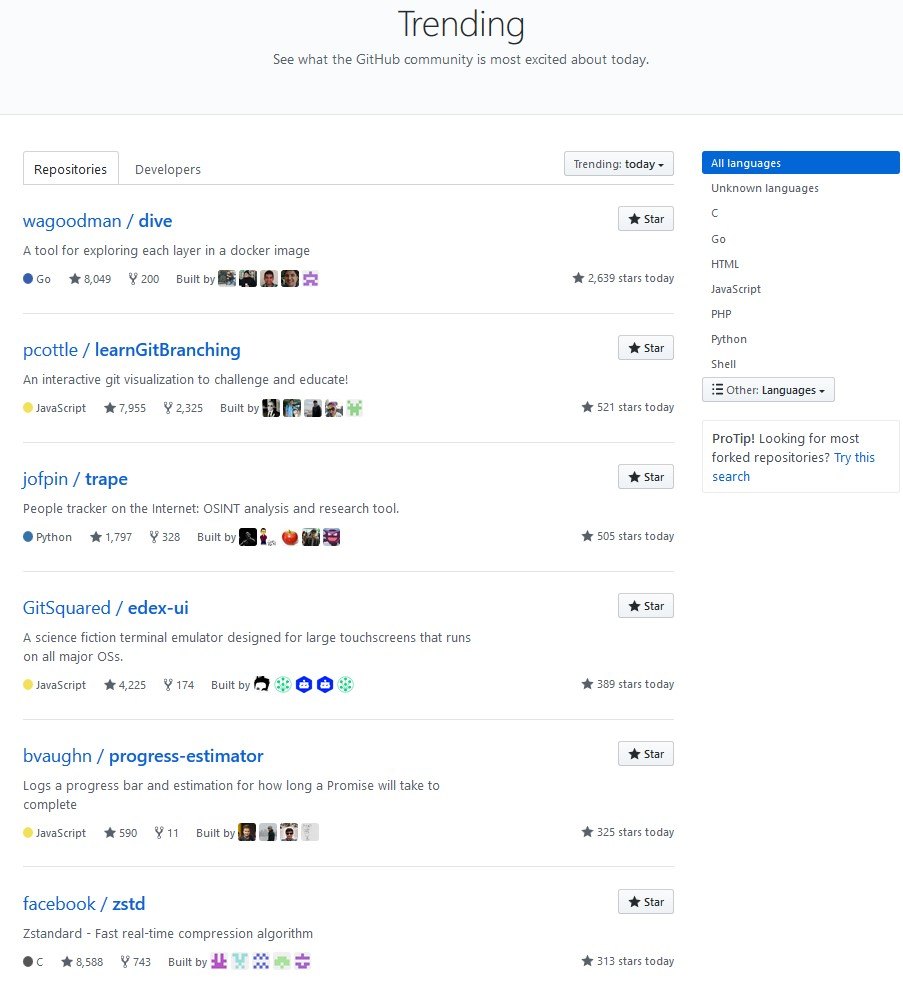
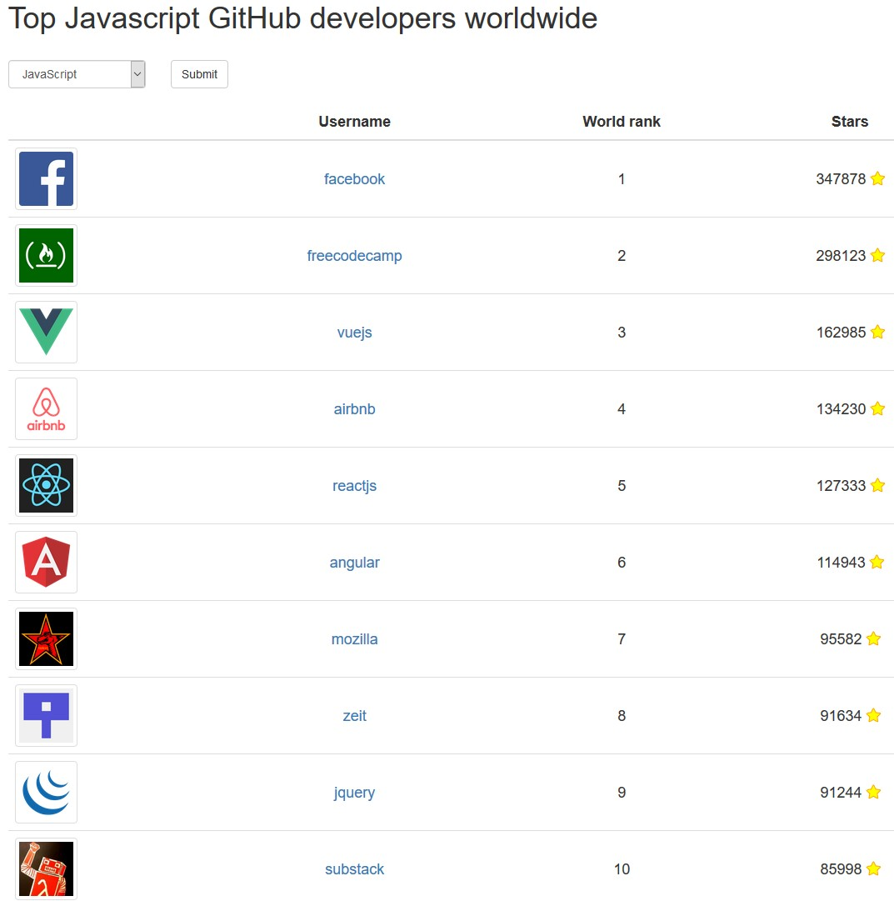
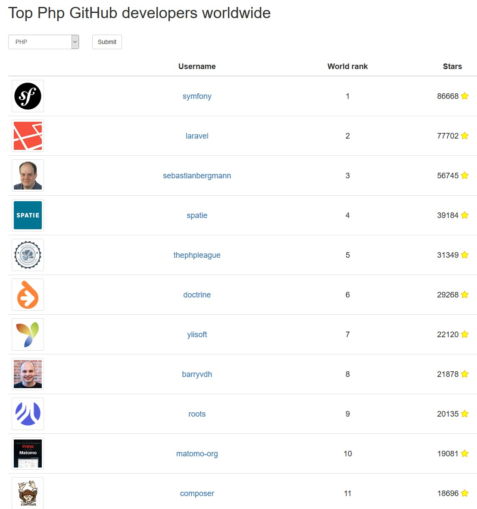

#Statistics

## Trending
https://github.com/trending
See what the GitHub community is most excited about today.

## Most active GitHub users (git.io/top)
https://gist.github.com/paulmillr/2657075/
The count of contributions (summary of Pull Requests, opened issues and commits) to public repos at GitHub.com from Tue, 06 Dec 2016 17:06:46 GMT till Wed, 06 Dec 2017 17:06:46 GMT.

Only first 1000 GitHub users according to the count of followers are taken. This is because of limitations of GitHub search. Sorting algo in pseudocode:

    githubUsers
      .filter(user => user.followers > 1000)
      .sortBy('contributions')
      .slice(0, 256)
      
      

## Top Javascript GitHub developers worldwide
http://git-awards.com/users

## Top Php GitHub developers worldwide
http://git-awards.com/users?utf8=%E2%9C%93&type=world&language=php

## My Stat

